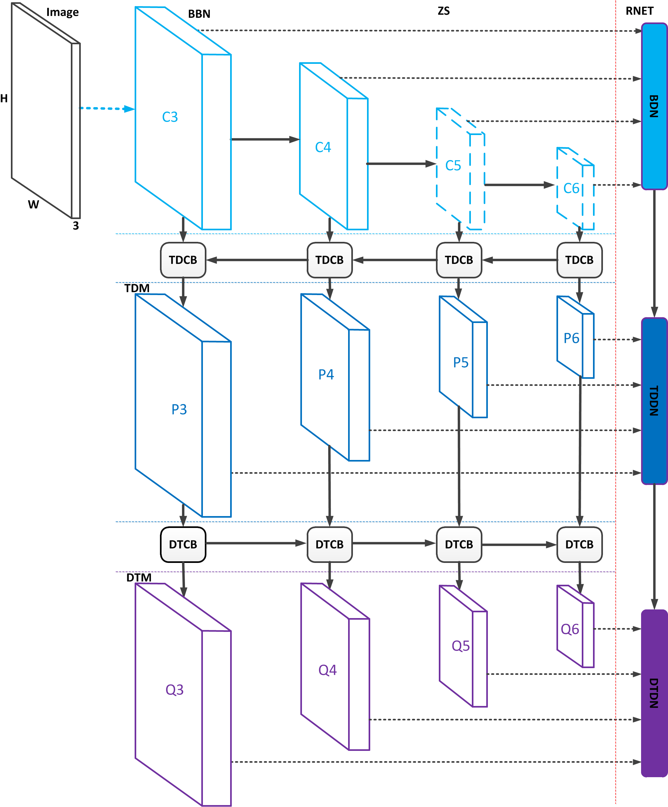

# ZRNet
## The Z-style Residual Network 



### Introduction
Similar to SSD, ZRNet is proposal-free based, which can be trained and tested in an end-to-end manner. As shown in the above Figure, ZRNet is formed by two parts, Z-style structure (ZS) and the residual network (RNet). The Z-style structure aims to combine features on multi-scales and multi-paths so as to provide sophisticated features for residual network, whereas the residual network aims to produce accurate bounding boxes and multi-class softmax probability. The Z-style structure is constructed by the backbone network (BBN), top-down connection block (TDCB), top-down module (TDM), down-top connection block (DTCB) and down-top module (DTM), where the top-down connection block and down-top connection block are devoted to convert features from backbone network to top-down module then to down-top module. The residual network is consist of backbone detection network (BDN), top-down detection network (TDDN) and down-top detection network (DTDN). The backbone detection network predicts scores and shape offsets. The top-down detection network produces scores and the residual between the predicted boxes of backbone detection network and the ground truth boxes. Scores and the residual are also predicted by the down-top detection network, where the difference is that the residual is between the predicted boxes of top-down detection network and the ground truth boxes.

### Contents
1. [Installation](#installation)
2. [Requirements](#requirements)
3. [Models](#models)
4. [Testing](#testing)
5. [Training](#training)

### Installation
1. Get the code. We will call the cloned directory as `$ZRNet_ROOT`.
  ```Shell
  git clone https://github.com/XRDai/ZRNet
  ```
  
 ### Requirements

2. The code requires [Python 2.7](https://www.python.org/download/releases/2.7/), [Tensorflow 1.3.0](https://www.tensorflow.org/install/), as well as the following python libraries: 

* tensorflow
* numpy
* json
* logging
* os
* time
* argparse
* scipy
* PIL
* inspect
* collections
* tarfile

Download the KITTI dataset(http://www.cvlibs.net/datasets/kitti/eval_object.php). Unzip the training images, testing images and the labels in $ZRNet_ROOT/KITTI/training and  $ZRNet_ROOT/KITTI/testing.

 ### Models
3. We have provided the models that are trained from KITTI traing set. 
  [KITTI models (VGG-16)](https://drive.google.com/open?id=1n-UwjrO7J_3ZaS7UBPsbxjtMIqQYYByk)
  
  You can download our pre-trained models and unrar it in $ZRNet_ROOT

### Testing
4. 
```Shell
  python test.py 
```
Then you will get the detection results of KITTI dataset in './OUT'. If you submit the results to the KITTI offical website, you will get the following results:


| ---------------| Moderate |  Easy |  Hard |

| ZRNet (VGG1-6) |  88.82   | 89.77 | 79.07 | 

It requires about 0.048ms for each image. The inference time will be acquired
```Shell
python test_time.py
```

### Traing 
5. The training code will be appear soon.

### Acknowledge
We have benifited a lot from [RON_Tensorflow](https://github.com/HiKapok/RON_Tensorflow).
